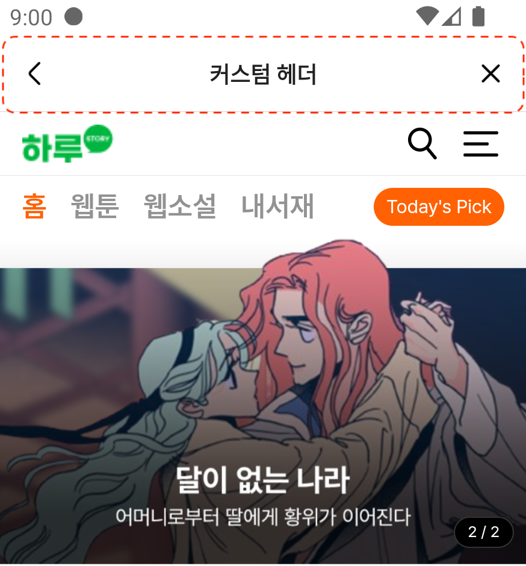

# Options
## ヘッダースタイル
Launcher Builder Option -> withHeader(headerModel: SceneHeaderModel) 設定による構成
:heavy\_check\_mark: <mark style="color:red;">**設定を行わない場合、ヘッダーは表示されません。**</mark>

### プリセット
基本設定値を使用してヘッダーを構成します。
| View Height | Title            | Title Size | Title Style | Title Color |
| ----------- | ---------------- | ---------- | ----------- | ----------- |
| 48.5dp      | option(nullable) | 14dp       | bold        | #212121     |

<figure><figcaption><p>プリセット</p></figcaption></figure>

バック、クローズ、タイトルの表示有無を設定可能で、"Back & Close"は画面を閉じる同一の動作を実行します。




```kotlin
val headerModel = SceneHeaderModel.Builder()
    // ヘッダータイトル（空値の場合タイトル表示されません）
    .withHeaderTitle(title = "トレジャーアイランド")
    // ヘッダーバックボタン使用
    .withUseBackButton(use = true)
    // ヘッダークローズボタン使用
    .withUseCloseButton(use = true)
    .build()
//...
//...
// Launcher Builder
//...
launcherBuilder.withHeader(headerModel = headerModel)
```





```java
SceneHeaderModel.Builder headerBuilder = new SceneHeaderModel.Builder();
// ヘッダータイトル（空値の場合タイトル表示されません）
headerBuilder.withHeaderTitle("トレジャーアイランド");
// ヘッダーバックボタン使用
headerBuilder.withUseBackButton(true);
// ヘッダークローズボタン使用
headerBuilder.withUseCloseButton(true);
SceneHeaderModel headerModel = headerBuilder.build();
//...
// Launcher Builder
//...
launcherBuilder.withHeader(headerModel);
```




***

### カスタム
アプリスタイルに合わせた独自のヘッダーを構成できます。
:heavy\_check\_mark: ヘッダーレイアウトを構成します。
:heavy\_check\_mark: ヘッダーレイアウトでアクションを処理するR.id値を定義します。

<figure><figcaption><p>カスタムヘッダー</p></figcaption></figure>




```kotlin
val customHeaderModel = SceneHeaderModel.CustomBuilder()
    // カスタムヘッダーレイアウトID
    .withHeaderLayoutId(layoutId = R.layout.custom_header_view)
    // カスタムヘッダーレイアウトアクションビューIDとアクション（クリック）
    .addHeaderAction(actionViewId = R.id.button_custom_header_back, action = object: SceneHeaderModel.IHeaderAction {
        override fun onAction(activity: Activity, webView: WebView?) {
            activity.finish()
        }
    })
    .build()
//...
//...
// Launcher Builder
//...
launcherBuilder.withHeader(headerModel = customHeaderModel)
```





```java
SceneHeaderModel.CustomBuilder customBuilder = new SceneHeaderModel.CustomBuilder();
customBuilder.withHeaderLayoutId(R.layout.custom_header_view);
customBuilder.addHeaderAction(R.id.button_custom_header_back, new SceneHeaderModel.IHeaderAction() {
    @Override
    public void onAction(@NonNull Activity activity, @Nullable WebView webView)
        activity.finish();
    }
});
SceneHeaderModel.CustomBuilder customModel = customBuilder.build();
//...
//...
// Launcher Builder
//...
launcherBuilder.withHeader(customModel);
```




***
