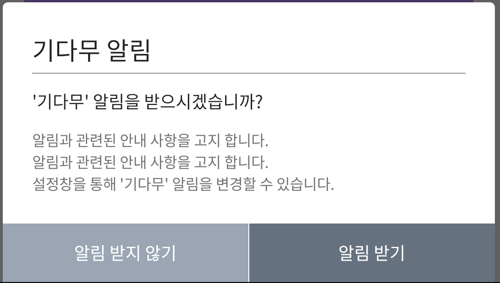
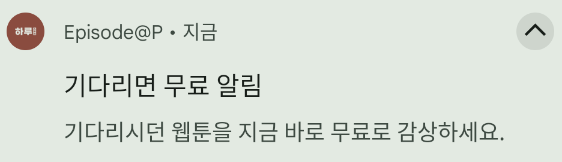

# トレジャーアイランド通知サービス@PLUG
***

**トレジャーアイランドの待てば無料サービス利用時にユーザーにプッシュ通知を送信する機能です。**
***
トレジャーアイランド通知サービスはローカルプッシュで、別途のサーバー連携作業が不要です。

<figure><figcaption><p>待てば無料通知設定例画面</p></figcaption></figure>
<figure><figcaption><p>待てば無料通知例画面</p></figcaption></figure>

***

## 基本モジュールの適用
基本ブロックを**アプリ（モジュール）レベルの"build.gradle"**ファイルに設定してください。

最新バージョンの使用を推奨しており、:link:[release.md](release.md "mention")で最新バージョンを確認してください。
***
通知サービス（treasureisland-plug-notify）のバージョンは**トレジャーアイランド基本モジュールのバージョンと同一です**。


```gradle
dependencies {
  implementation 'kr.co.studioguru.sdk:treasureisland-plug-notify:{SDK-VERSION}'
}
```


***

## SDKの初期化
トレジャーアイランドSDK初期化時にwithNotificationOption()設定を行います。
<mark style="color:red;">生成されたBuilderインスタンスを通じてオプションとSDKの初期化を行います。</mark>




```kotlin
class AppApplication : Application() {
    override fun onCreate() {
        super.onCreate()
        SceneConfig.Builder(...)
        // optionプッシュ通知設定
        .withNotificationOption(
            config = SceneConfig.NotificationOption(
                allow = true,
                channelName = "通知チャンネル名",
                iconResourceId = R.drawable.ic_notification
            )
        )
        .build()?.initialize()
    }
}
```




```java
public class AppApplication extends Application {
    @Override
    public void onCreate() {
        super.onCreate();
        TreasureConfig.Builder builder = new TreasureConfig.Builder(...);
        // optionプッシュ通知設定
        builder.withNotificationOption(new TreasureConfig.NotificationOption(
            true,
            "トレジャーアイランド",
            R.drawable.ic_notify
        ));
        TreasureConfig treasureConfig = builder.build();
        if (treasureConfig != null) {
            treasureConfig.initialize();
        }
    }
}
```




#### 🎈withNotificationOption(config: SceneConfig.NotificationOption)
待てば無料プッシュ通知を設定します。
:heavy\_check\_mark: デフォルト値 -> プッシュ通知を使用しません。
⬇ SceneConfig.NotificationOption
<table><thead><tr><th width="242">Name</th><th>Type</th><th>Description</th></tr></thead><tbody><tr><td><code>allow</code></td><td>boolean</td><td>プッシュ通知使用可否<br><code>デフォルト値: false</code></td></tr><tr><td><code>channelName</code></td><td>string(<code>nullable</code>)</td><td>プッシュ通知チャンネル名<br><code>デフォルト値: 'トレジャーアイランド'</code></td></tr><tr><td><code>smallIconResourceId</code></td><td><strong>'@'DrawableRes</strong>(<code>nullable</code>)</td><td>プッシュ通知アイコンリソース<br><code>デフォルト値: トレジャーアイランドアイコン</code></td></tr></tbody></table>
