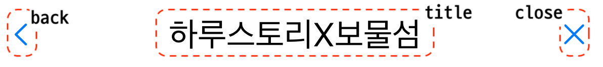
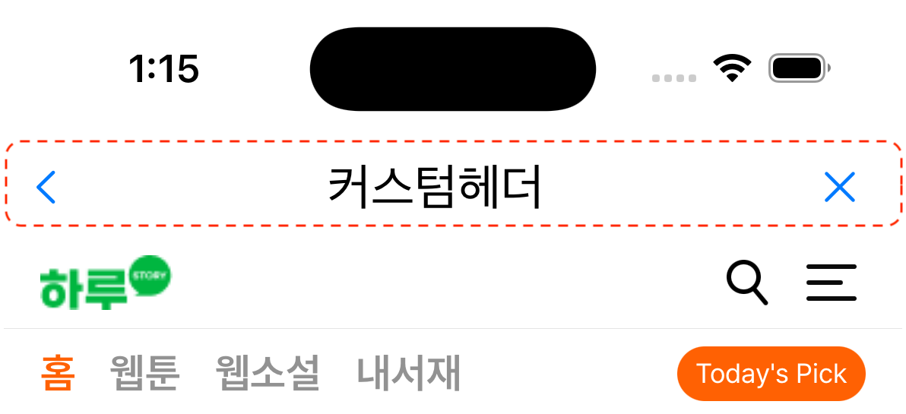

# Options

## ヘッダースタイル

Launcher Builder Option -> withHeader(headerModel: SceneHeaderModel) の設定による構成

:heavy\_check\_mark: <mark style="color:red;">**設定を行わない場合、ヘッダーは表示されません。**</mark>

### プリセット

基本設定値を使用してヘッダーを構成します。

| View Height | Title            | Font    | Title Color |
| ----------- | ---------------- | ------- | ----------- |
| 44          | option(nullable) | .title2 | #000000     |

<figure><figcaption><p>プリセット</p></figcaption></figure>

バック、クローズ、タイトルの表示有無を設定可能で、"Back & Close"は画面を閉じる同一の動作を実行します。


```swift
let presetHeader = SceneHeaderModel.PresetBuilder()
    // ヘッダータイトル（空値の場合タイトル表示されません）
    .withTitle("ハルストーリーXトレジャーアイランド")
    // ヘッダーバックボタンの使用
    .withUseBackButton(true)
    // ヘッダークローズボタンの使用
    .withUseCloseButton(true)
    .build()

//...
//...
// launchKit builder
launchKitBuilder.withHeader(headerModel: presetHeader)
// ..
// launchKit launch
```


***

### カスタム

アプリスタイルに合わせた独自のヘッダーを構成できます。

:heavy\_check\_mark: ヘッダーUIViewを作成します。

:heavy\_check\_mark: UIViewSceneHeader(UIView継承)クラスを継承するUIViewを設定します。

:heavy\_check\_mark: withHeader関数を通じて生成されたViewを設定します。

UIViewSceneHeaderには参照可能なUIViewController、WKWebViewプロパティが存在します。

| UIViewController       | WKWebView     |
| ---------------------- | ------------- |
| sceneUIViewController? | sceneWebView? |

<figure><figcaption><p>カスタムヘッダー</p></figcaption></figure>

#### カスタムヘッダーコード例

[Previous code block remains unchanged, only translating comments to Japanese]

#### カスタムビューの設定

```swift
let customHeader = SceneHeaderModel.CustomBuilder()
    // UIViewのインスタンスを設定します
    .withView(CustomHeader())
    .build()
    
//...
//...
// launchKit builder
launchKitBuilder.withHeader(headerModel: customHeader)
// ..
// launchKit launch
```
