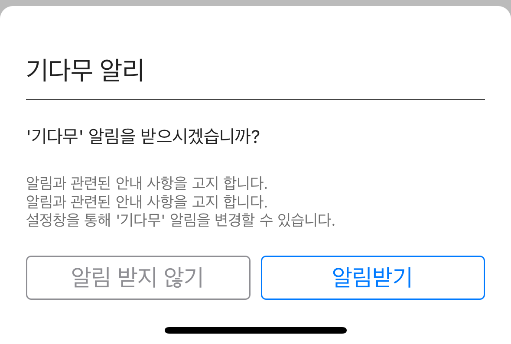
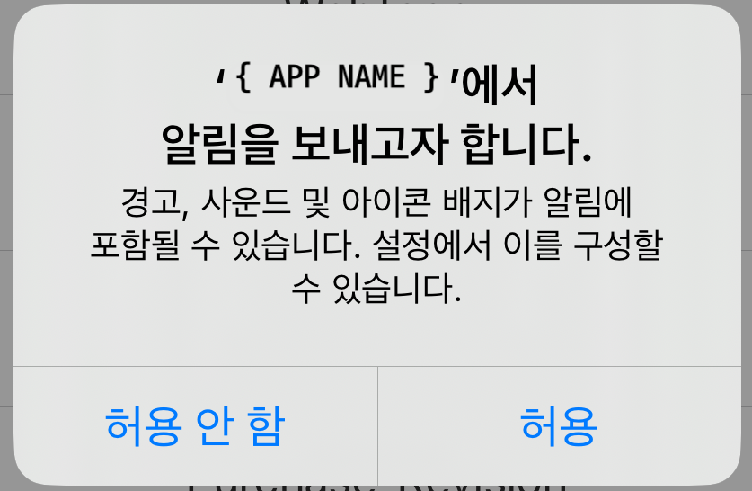
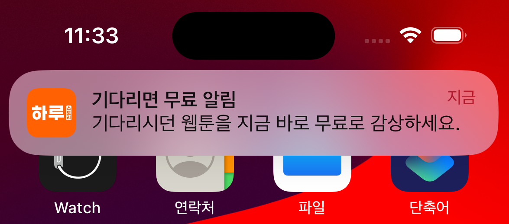
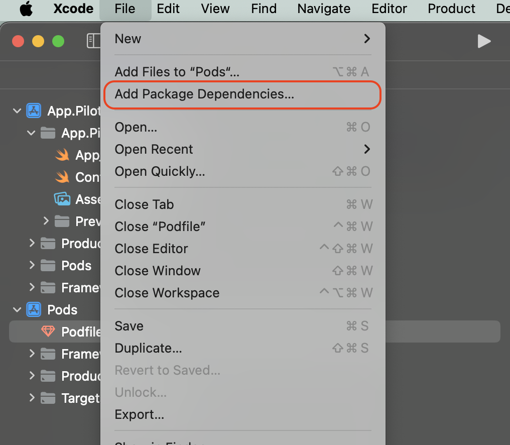
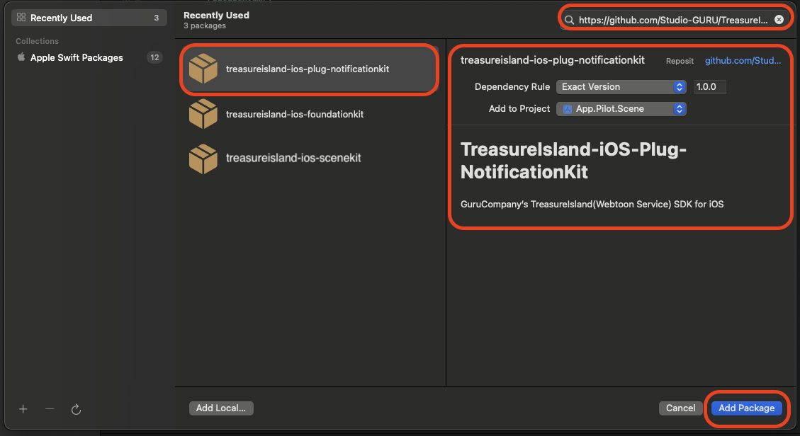

# トレジャーアイランド通知サービス@PLUG
***

**トレジャーアイランドの待てば無料サービス利用時にユーザーにプッシュ通知を送信する機能です。**
***
トレジャーアイランド通知サービスは**ローカルプッシュ**で、別途のサーバー連携作業が不要です。


<div><figure><figcaption><p>待てば無料設定画面</p></figcaption></figure> <figure><figcaption></figcaption></figure> <figure><figcaption></figcaption></figure></div>

***

## 連携手順
1. **TreasureIslandPlugNotificationKit**モジュールのインストール
2. **TreasureIslandPlugNotificationKit**モジュールの連携

***

## モジュールのインストール
###  COCOA PODS
トレジャーアイランドSDKをインストールするプロジェクトのPodfileに以下の項目を追加します。


**モジュール情報**
***
:heavy\_check\_mark: pod 'TreasureIslandFoundationKit', '{SDK-VERSION}'
:heavy\_check\_mark: pod 'TreasureIslandSceneKit', '{SDK-VERSION}'
:heavy\_check\_mark: pod '**TreasureIslandPlugNotificationKit**', '{SDK-VERSION}'



```sh
# pod respository url
source 'https://github.com/CocoaPods/Specs.git'
# target project
target '{TARGET-PROJECT}' do
  use_frameworks!
  # トレジャーアイランド必須SDK
  pod 'TreasureIslandFoundationKit', '{SDK-VERSION}'
  pod 'TreasureIslandSceneKit', '{SDK-VERSION}''
  # トレジャーアイランド通知サービスSDK(Notififatioin PLUG)
  pod 'TreasureIslandPlugNotificationKit', '{SDK-VERSION}''
end
```


pod installコマンドでトレジャーアイランドSDKをインストールします。
```sh
$ pod install
```

###  SWIFT PACKAGE

**基本モジュール適用**
***
:heavy\_check\_mark: [https://github.com/Studio-GURU/TreasureIsland-iOS-Plug-NotificationKit.git](https://github.com/Studio-GURU/TreasureIsland-iOS-Plug-NotificationKit.git)


#### Package Dependency設定
**⬇ Xcode -> File -> Add Package Dependencies...**&#x20;
<figure><figcaption></figcaption></figure>
<figure><figcaption></figcaption></figure>

***

## モジュール連携
トレジャーアイランドの初期化部分に以下のコードを追加します。


```swift
import TreasureIslandFoundationKit
import TreasureIslandSceneKit
// import!!
import TreasureIslandPlugNotificationKit
// SceneKit
let sceneKit = SceneKit.Builder(
    appId: "{APP-ID}", 
    appSecret: "{APP-SECRET}"
)
// option: ログ出力の有無を設定
.withAllowLog(allow: true)
// PlugNotificationKitを追加します
.withContractorNotification(builder: PlugNotificationKit.builder())
// TreasureKitインスタンスの生成
.build()
// トレジャーアイランドSDKの初期化
sceneKit.initialize()
```

