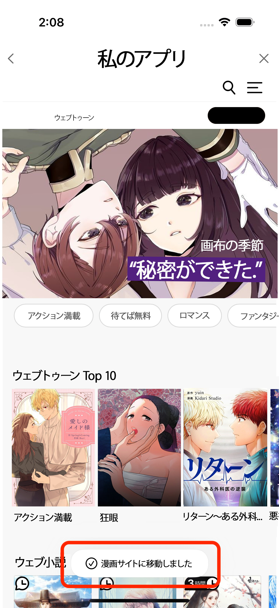
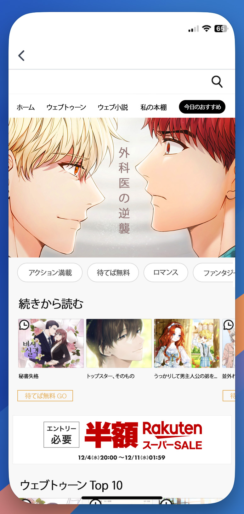

# ボムルソムチャネリング


メイン画面へのアクセス

***

メイン画面アクセスパスに<mark style="color:red;">**signパラメータ**</mark>を渡してトレジャーアイランドのメイン画面にアクセスします。


## メイン画面アクセスパス

`https://{env}.treasurecomics.com/gateway/common?sign={sign-value}&returnUrl=https://{env}.treasurecomics.com/main` :heavy\_check\_mark: returnUrlはUrlEncodeされた値で渡します。

### **シグネチャの生成**


**シグネチャの生成（**<mark style="color:red;">**HmacSHA256生成に必要なKeyは営業チームより提供されます**</mark>**）**

***

:heavy\_check\_mark: $timeStamp$nonce$暗号化されたユーザー識別子 上記の値をHmacSHA256 Hash -> Base64 Url Encodingを通じてシグネチャを生成します。

***

* timeStamp -> unixタイムスタンプ（秒）
* nonce -> 32文字の文字列（ランダムに生成された32文字）
* ユーザー識別子 -> 会員を区別できる識別子


<table data-full-width="false"><thead><tr><th width="127">Name</th><th width="141">Type</th><th>Description</th></tr></thead><tbody><tr><td><code>sign</code></td><td>string</td><td>
<code>timestmap.nonce.encryptedUserId.signature</code>

<mark style="background-color:red;">timestamp、nonce、useridの値は<strong>シグネチャ生成に使用された値</strong>を渡します。</mark>
</td></tr></tbody></table>

\### 使用例 https://test.treasurecomics.com/gateway/common?sign=1724922215.7b82817d9487471a8a782c2604883924.lymanTest.M21MZORoc4NbVzq1ZaSC8LgcOKYH9SBIljHYjVOfX5o%3D\&returnUrl=https%3A%2F%2Ftest.treasurecomics.com%2Fmain \*\*\* ## メイン画面アクセス時のガイダンスメッセージ表示


メイン画面アクセス時に、以下のようなトレジャーアイランドサービスへのアクセスに関するガイダンスメッセージを表示する必要があります。

***

:heavy\_check\_mark: メッセージ：「**ウェブトゥーンサイトに移動しました。**」


<figure><figcaption>
ガイダンスメッセージ表示例画面
</figcaption></figure>

\*\*\* ## メイン画面

<figure><figcaption></figcaption></figure>

