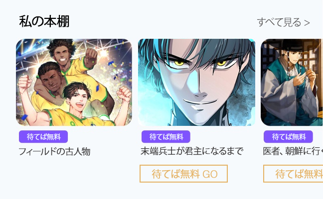

# 最近見た作品の照会

## バージョン

バージョン情報はURL経路に表現せず、ヘッダーのaccept-version属性値に定義します。

| Version | Date       | Description |
| ------- | ---------- | ----------- |
| 1.0.0   | 2024.08.23 | Create      |

## 最近閲覧したコンテンツ

<mark style="color:green;">`GET`</mark> `https://api-{env}.treasurecomics.com/external/recentView?sign={value}`

ユーザーの最近閲覧したコンテンツリストを返します。

### ヘッダー

| Name           | Value              |
| -------------- | ------------------ |
| Content-Type   | `application/json` |
| Authorization  | `Basic token`      |
| Accept-Version | `1.0.0`            |

### **ボディ**


**シグネチャの生成（**<mark style="color:red;">**HmacSHA256生成に必要なKeyは営業チームより提供されます**</mark>**）**

***

:heavy\_check\_mark: $timeStamp$nonce$暗号化されたユーザー識別子

上記の値をHmacSHA256 Hash -> Base64 Url Encodingを通じてシグネチャを生成します。

***

* timeStamp -> unixタイムスタンプ（秒）
* nonce -> 32文字の文字列（ランダムに生成された32文字）
* ユーザー識別子 -> 会員を区別できる識別子


<table data-full-width="false"><thead><tr><th width="127">Name</th><th width="141">Type</th><th>Description</th></tr></thead><tbody><tr><td><code>sign</code></td><td>string</td><td><p><code>timestmap.nonce.encryptedUserId.signature</code></p><p><mark style="background-color:red;">timestamp、nonce、useridの値は<strong>シグネチャ生成に使用された値</strong>を渡します。</mark></p></td></tr></tbody></table>

```
// get usage example
https://api-{env}.treasurecomics.com/external/recentView?sign=1724328195.3da08653e6c1420aac89eecdf5c20063.OGMzYjUzYTUyYjE1YTJiNDAyZGM3MGJiZmMzMDI2YWE1NDg0YWY2ZTdjNjMyZTJlMTdjMjQyOGU1NjZhYjdhYQ
```

### **レスポンス**

<table><thead><tr><th width="270">Fields</th><th width="106">Type</th><th>Description</th></tr></thead><tbody><tr><td><code>title</code></td><td>string</td><td>タイトル</td></tr><tr><td><code>description</code></td><td>string</td><td>内容</td></tr><tr><td><code>thumbnail</code></td><td>string</td><td>画像パス</td></tr><tr><td><code>contentType</code></td><td>string</td><td>ウェブトゥーン | ウェブ小説</td></tr><tr><td><code>contentCName</code></td><td>string</td><td>作品キー</td></tr><tr><td><code>episodeNo</code></td><td>number</td><td>エピソード番号</td></tr><tr><td><code>genre</code></td><td>string</td><td>ジャンル</td></tr><tr><td><code>link</code></td><td>string</td><td><p>提供されるリンクの後ろにsignを付けて渡す</p><p>例：<code>&#x26;sign=1724328195.3da08653e6c1420aac89eecdf5c20063.OGMzYjUzYTUyYjE1YTJiNDAyZGM3MGJiZmMzMDI2YWE1NDg0YWY2ZTdjNjMyZTJlMTdjMjQyOGU1NjZhYjdhYQ</code></p></td></tr><tr><td><code>returnUrl</code></td><td>string</td><td>最終遷移リンク（参考用）</td></tr><tr><td><code>isWaitFree</code></td><td>boolean</td><td>待てば無料かどうか</td></tr><tr><td><code>waitFreeInfo(optional)</code></td><td>object</td><td>待てば無料チケット情報</td></tr><tr><td></td><td></td><td><p><code>{</code><br><code>chargedTicket: boolean,</code><br><code>baseDate: Date,</code><br><code>chargedDate: Date</code><br><code>}</code></p><p><span data-gb-custom-inline data-tag="emoji" data-code="2714">✔️</span> <mark style="background-color:purple;">chargedTicket: 待てば無料チケット所持の有無</mark><br><span data-gb-custom-inline data-tag="emoji" data-code="2714">✔️</span> <mark style="background-color:purple;">baseDate: チケット計算基準日</mark><br><span data-gb-custom-inline data-tag="emoji" data-code="2714">✔️</span> <mark style="background-color:purple;">chargeDate: チケット付与日</mark></p></td></tr></tbody></table>

**レスポンスコード**




```json
[
  {
    "title": "ドラゴンの育て方10ステップ",
    "description": null,
    "thumbnail": "https://s.treasurecomics.com/images/test/webtoon/cw4357a295d0/thumbnail_1718174618.jpg",
    "contentType": "ウェブトゥーン",
    "contentCName": "cw4357a295d0",
    "contentEpisodeTitle": "第1話",
    "genre": "ドラマ,ホラー/スリラー",
    "link": "https://test.treasurecomics.com/gateway/toss?returnUrl=https%3A%2F%2Ftest.treasurecomics.com%2Fcontent%2Flist%2Fcw4357a295d0",
    "returnUrl": "https://test.treasurecomics.com/content/list/cw4357a295d0",
    "isWaitFree": true,
    "waitFreeInfo": {
        chargedTicket: true,
        baseDate: "2024-09-27T03:00:00Z",
        chargedDate: "2024-09-27T03:00:00Z"
    }
  }
]
```





```json
{
  "code": "err_already_used_signature",
  "message": "既に使用されたシグネチャです。",
  "data": null,
  "appendix": {
    "reason": "既に使用されたシグネチャです。",
    "stack": "Error: UNHANDLED\n    at _validateSignature (/var/app/current/build/controllers/external/toss/recentView/get.1.0.0.js:33:15)\n    at process.processTicksAndRejections (node:internal/process/task_queues:95:5)"
  }
}
```




#### レスポンスエラーコード

<table><thead><tr><th width="307">Code</th><th>Reason</th><th>Message</th></tr></thead><tbody><tr><td><mark style="color:red;"><code>err_invalid_signature</code></mark></td><td>シグネチャ検証失敗</td><td>無効なシグネチャです。</td></tr><tr><td><mark style="color:red;"><code>err_already_used_signature</code></mark></td><td>使用済みシグネチャの再使用<br>-> 5分間制限</td><td>既に使用されたシグネチャです。</td></tr></tbody></table>

***

## 最近閲覧した作品の照会実装画面例

<div align="left"><figure><figcaption></figcaption></figure></div>
