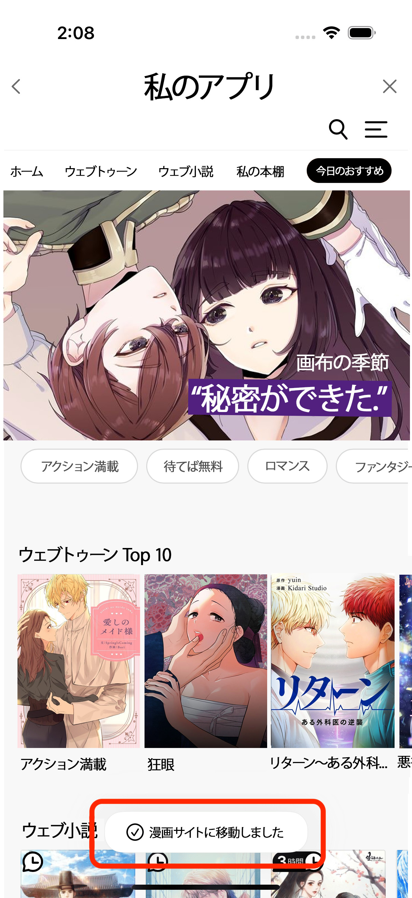
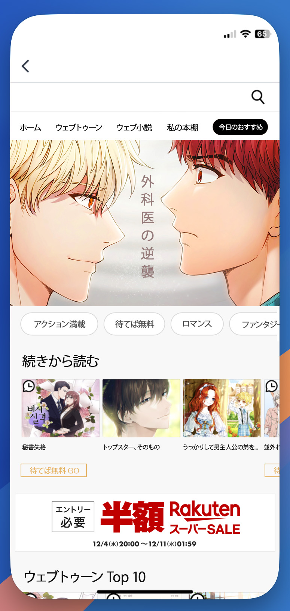

# ボムルソムチャネリング


メイン画面にアクセスする方法

***

:ballot\_box\_with\_check: <mark style="color:red;">**既存画面ではなく、新しいウィンドウでボムルソムを実行してください！**</mark>

:heavy\_check\_mark: メイン画面へのアクセス経路に <mark style="color:red;">**sign parameter**</mark> を渡してボムルソムメイン画面にアクセスします。


## メイン画面アクセス経路

`https://{env}.treasurecomics.com/gateway/common?sign={sign-value}&returnUrl=https://{env}.treasurecomics.com/main`

:heavy\_check\_mark: returnUrl は UrlEncode された値として渡します。

:white\_check\_mark: `{env}` の値は **営業チームを通じて個別に提供** されます。

### **signature の生成**


**signature を生成する方法 (**<mark style="color:red;">**HmacSHA256 の生成に必要なキーは営業チームから提供されます。**</mark>**)**

***

:heavy\_check\_mark: $timeStamp$nonce$暗号化されたユーザー識別子

上記の値を HmacSHA256 Hash -> Base64 Url Encode を行い、Signature を生成します。

***

* timeStamp -> UNIX タイムスタンプ（秒単位）
* nonce -> ランダムに生成された32文字の文字列
* user識別子 -> ユーザーを識別可能なID


<table data-full-width="false"><thead><tr><th width="127">Name</th><th width="141">Type</th><th>Description</th></tr></thead><tbody><tr><td><code>sign</code></td><td>string</td><td>
<code>timestmap.nonce.encryptedUserId.signature</code>

<mark style="background-color:red;">timestamp、nonce、userid の値は<strong>signature 生成に使用した値</strong>を渡します。</mark>
</td></tr></tbody></table>

### 使用例

https://test.treasurecomics.com/gateway/common?sign=1724922215.7b82817d9487471a8a782c2604883924.lymanTest.M21MZORoc4NbVzq1ZaSC8LgcOKYH9SBIljHYjVOfX5o%3D\&returnUrl=https%3A%2F%2Ftest.treasurecomics.com%2Fmain

***

<figure><figcaption>
案内メッセージ表示例
</figcaption></figure>

***

## メイン画面

<figure><figcaption></figcaption></figure>

